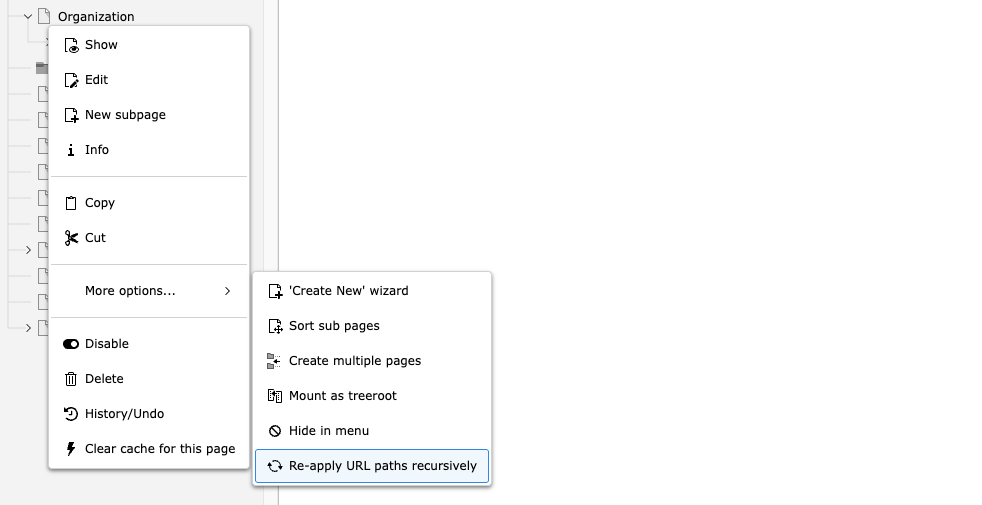

# _sluggi_ – The URL Path Manager TYPO3 deserves

[](https://github.com/wazum/sluggi/actions)
[](https://www.php.net/)
[](https://typo3.org/)
[](LICENSE)

URLs that stay in sync when titles change. Automatic redirects. Duplicate prevention on copy, move, and recycler restore. Locking, access control, conflict detection – everything you need to manage URL paths with confidence.

One `composer require`, sensible defaults – [highly configurable](#configuration) when you need it.

> **[Try the interactive demo](https://wazum.github.io/sluggi/)** – see every feature live in your browser, no installation required.


## Installation

```bash
composer require wazum/sluggi
```

## What You Get

**Automatic sync** – Rename a page, the URL updates. All child pages follow. Redirects are created automatically.

**Conflict detection** – Duplicate URLs are caught instantly with unique alternatives proposed.

**Locking** – Pin critical URLs so nobody accidentally breaks them.

**Access control** – Let editors change the last segment only, or restrict editing based on their page tree permissions.

**Duplicate prevention** – Unique slugs on copy, move, and recycler restore. No more 500 errors from slug collisions.

**Redirect control** – Editors choose whether to create redirects when changing a URL.

**Any table** – Works with pages, news, events, or any record with a TCA slug field.

## Features

### Modern URL Path Editor

Out of the box, _sluggi_ replaces the default slug field with a clean, focused interface:


### Auto-Sync: Change a Title, Update the URL

When sync is enabled, URL paths regenerate automatically when source fields (e.g. title, nav_title) change. A badge on the source field shows it drives the URL:


- Per-page sync toggle – disable it for pages with manually crafted URLs
- Child pages update recursively when a parent path changes
- Redirects from old to new URL are created automatically via EXT:redirects
- Works for any table with a slug field (news, events, custom records)

### Lock URLs to Prevent Accidental Changes


- Locked URLs cannot be edited and are skipped during auto-sync
- Optionally lock all descendant paths when an ancestor is locked
- Editing the full path auto-locks it to prevent sync from overwriting your work

### Granular Access Control for Editors

**Last segment only** – Non-admins edit just the final path segment. The parent path is read-only:


**Full path editing** – A button lets permitted users temporarily unlock the full path:


**Hierarchy permissions** – Editing is restricted based on page tree permissions. Users can only modify segments for pages they're allowed to edit:


### Redirect Control

Let editors decide whether to create redirects when a URL changes:


The choice applies recursively to all affected child pages. Self-referencing redirects are prevented automatically, and stale redirect cleanup only affects auto-created redirects – manually created redirects are never touched.

### Re-apply URL Paths Recursively

Right-click any page in the page tree and select **More options > Re-apply URL paths recursively** to regenerate URL paths for all descendant pages based on their current source fields (e.g. title, nav_title):



- Useful after reverting a slug change via TYPO3's undo notification, or when child pages have stale prefixes
- Slugs are regenerated from scratch using source fields – not by prefix replacement
- Hidden pages are included, locked pages are skipped (descendants still update unless `lock_descendants` is enabled)
- All changes share a single correlation ID – TYPO3's undo notification lets you revert everything at once
- Admin users only

### Copy URL to Clipboard


### Slug Normalization

TYPO3 core turns a title like "Products/Services" into `/products/services` (two segments) instead of `/products-services` (one segment). _sluggi_ fixes this globally – for manual edits, auto-sync, regeneration, and page tree inline editing. Optional underscore preservation (RFC 3986) is also available.

### Duplicate Prevention Where TYPO3 Core Doesn't

- **Copy**: Copied pages get unique slugs in the target location
- **Move**: Child slugs update to reflect the new parent path
- **Recycler restore**: Restored records get deduplicated slugs instead of causing 500 errors

### Excluded Page Types

Remove URL paths from page types that don't need them (Sysfolder, Recycler, Spacer). An upgrade wizard cleans up existing slugs.

## Configuration

All features work out of the box with sensible defaults. Fine-tune via **System > Settings > Extension Configuration > _sluggi_**:

**Basic**

| Setting | Description | Default |
|---------|-------------|---------|
| `exclude_doktypes` | Remove URL paths from page types that will never be visited directly. Comma-separated doktypes, e.g. `199,254,255` for Spacer, Sysfolder, and Recycler. Keeps your slug table clean. | – |
| `preserve_underscore` | Keep underscores in URL paths instead of converting them to dashes. Useful when your URL convention or external systems require underscores (RFC 3986 compliant). | Off |
| `copy_url` | Show a button to copy the full page URL to the clipboard. Saves editors from navigating to the frontend just to grab a link for emails, documents, or tickets. | On |
| `last_segment_only` | Non-admin editors can only change the last segment of a URL path. The parent path stays read-only, preventing editors from accidentally breaking the site's URL hierarchy. | Off |
| `allow_full_path_editing` | Show a button that lets permitted editors temporarily unlock the full path for editing (requires `last_segment_only`). The slug auto-locks afterwards to prevent sync from overwriting the custom path. | Off |

**Sync**

| Setting | Description | Default |
|---------|-------------|---------|
| `synchronize` | Keep URLs in sync with page titles automatically. When an editor renames a page, the URL path updates instantly – no manual work, no stale URLs. Redirects from old to new are created via EXT:redirects. | On |
| `synchronize_default` | Turn on sync for every newly created page. Editors can still disable it per page for manually crafted URLs. | On |
| `synchronize_tables` | Extend auto-sync beyond pages to any table with a slug field. Comma-separated list, e.g. `tx_news_domain_model_news`. Supports multi-field generation with `fieldSeparator`. | – |

**Lock**

| Setting | Description | Default |
|---------|-------------|---------|
| `lock` | Let editors pin important URLs so they can't be changed accidentally. Locked paths are also skipped during auto-sync, giving you full control over critical landing page URLs. | Off |
| `lock_descendants` | When a parent page has a locked URL, protect all child page URLs too. Useful for entire sections of your site where URL stability is critical (e.g. campaign landing pages). | Off |

**Redirect**

| Setting | Description | Default |
|---------|-------------|---------|
| `redirect_control` | Show a modal when a URL changes, letting the editor decide whether to create a redirect. Gives editors control instead of silently creating redirects they may not want. The choice applies recursively to all affected child pages. | Off |

For deployment or version-controlled configuration, set values in `config/system/additional.php`:

```php
$GLOBALS['TYPO3_CONF_VARS']['EXTENSIONS']['sluggi'] = [
    'synchronize' => '1',
    'synchronize_default' => '1',
    'synchronize_tables' => 'tx_news_domain_model_news',
    'lock' => '1',
    'lock_descendants' => '0',
    'last_segment_only' => '1',
    'allow_full_path_editing' => '1',
    'exclude_doktypes' => '199,254,255',
    'copy_url' => '1',
    'preserve_underscore' => '0',
    'redirect_control' => '1',
];
```

## Site Configuration: Redirects & Recursive Slug Updates

_sluggi_ requires [EXT:redirects](https://docs.typo3.org/c/typo3/cms-redirects/main/en-us/) which controls what happens when a page slug changes: whether child pages update recursively, whether redirects are created, how long they live, and which HTTP status code they use.

These settings are configured **per site** via [TYPO3 site sets](https://docs.typo3.org/m/typo3/reference-coreapi/main/en-us/ApiOverview/SiteHandling/SiteSettings.html). To activate them, add the `typo3/redirects` set to your site's `config.yaml` and override the defaults in `settings.yaml`.

### Step 1: Add the redirects site set

In `config/sites/<your-site>/config.yaml`, add `typo3/redirects` to the `dependencies` list:

```yaml
base: 'https://example.com/'
rootPageId: 1
dependencies:
  - typo3/redirects
languages:
  # ...
```

### Step 2: Override settings

Create `config/sites/<your-site>/settings.yaml` with the settings you want to change:

```yaml
redirects:
  autoUpdateSlugs: true
  autoCreateRedirects: true
  redirectTTL: 0
  httpStatusCode: 301
```

### Available Settings

| Setting | Type | Default | Description |
|---------|------|---------|-------------|
| `redirects.autoUpdateSlugs` | bool | `true` | Recursively update child page slugs when a parent slug changes. Works together with _sluggi_'s auto-sync – when a title change triggers a slug update on a parent page, all descendants get their slug prefix replaced automatically. |
| `redirects.autoCreateRedirects` | bool | `true` | Create redirect records from old to new URL when a slug changes. Only applies in the **live workspace** – editing in a workspace does not create redirects until the change is published. |
| `redirects.redirectTTL` | int | `0` | Lifetime in **days** for auto-created redirects. `0` means no expiration. When set, the redirect's `endtime` is calculated as creation time + TTL days. |
| `redirects.httpStatusCode` | int | `307` | HTTP status code for auto-created redirects. Does not affect manually created redirects. Common values: `301` (Moved Permanently – best for SEO), `302` (Found), `307` (Temporary Redirect – the default). |

> **How this relates to sluggi:** When _sluggi_'s auto-sync regenerates a slug (because the page title changed), EXT:redirects picks up the change and applies the settings above. If `autoUpdateSlugs` is enabled, child pages update recursively. If `autoCreateRedirects` is enabled, redirect records are created for the old URLs. The `redirectTTL` and `httpStatusCode` settings control the properties of those redirect records. When _sluggi_'s `redirect_control` feature is enabled, editors can override `autoCreateRedirects` on a per-change basis via a modal dialog.

### Ready-to-Use Configuration Presets

_sluggi_ ships ready-to-use presets in [`Configuration/SiteSettings/`](Configuration/SiteSettings/). TYPO3's YAML loader supports [`imports`](https://docs.typo3.org/m/typo3/reference-coreapi/main/en-us/ApiOverview/YamlApi/Index.html#imports) with `EXT:` paths, so you can reference them directly from your `settings.yaml` without copying files.

Create `config/sites/<your-site>/settings.yaml` with an import:

```yaml
imports:
  - { resource: 'EXT:sluggi/Configuration/SiteSettings/recommended.settings.yaml' }
```

You can override individual values after the import:

```yaml
imports:
  - { resource: 'EXT:sluggi/Configuration/SiteSettings/recommended.settings.yaml' }

# Override just the TTL from the preset
redirects:
  redirectTTL: 180
```

**Available presets:**

| Preset | Status code | TTL | Description |
|--------|:-----------:|:---:|-------------|
| [recommended](Configuration/SiteSettings/recommended.settings.yaml) | 301 | permanent | Best for production sites where SEO matters |
| [temporary-with-ttl](Configuration/SiteSettings/temporary-with-ttl.settings.yaml) | 307 | 90 days | Sites with frequently changing content (news, events, campaigns) |
| [no-auto-redirects](Configuration/SiteSettings/no-auto-redirects.settings.yaml) | – | – | Recursive slug updates only, redirects managed externally or manually |
| [manual-only](Configuration/SiteSettings/manual-only.settings.yaml) | – | – | No recursive updates, no auto-redirects, full manual control |

### How It All Fits Together

| What happens | `autoUpdateSlugs` | `autoCreateRedirects` | sluggi `synchronize` | sluggi `redirect_control` |
|---|:---:|:---:|:---:|:---:|
| Title changes → slug updates | – | – | **controls this** | – |
| Parent slug changes → child slugs update | **controls this** | – | – | – |
| Old URL → redirect to new URL | – | **controls this** | – | – |
| Editor chooses whether to create redirect | – | must be `true` | – | **controls this** |

For the full EXT:redirects documentation, see the [TYPO3 Redirects Setup](https://docs.typo3.org/c/typo3/cms-redirects/main/en-us/Setup/Index.html). For details on TYPO3 site sets and settings, see [Site Settings](https://docs.typo3.org/m/typo3/reference-coreapi/main/en-us/ApiOverview/SiteHandling/SiteSettings.html).

## Permissions

Every _sluggi_ feature integrates with TYPO3's standard backend user and group permissions. You decide per user group which editors can see and use which controls – the same way you manage access to any other field in TYPO3:

| Field | Permission controls |
|-------|---------------------|
| `pages:slug` | Edit the URL path |
| `pages:tx_sluggi_sync` | Toggle sync on/off |
| `pages:slug_locked` | Lock/unlock URLs |
| `pages:tx_sluggi_full_path` | Use full path editing |

Example setup for a typical editorial team:

| | Admin | Senior Editor | Editor |
|---|:---:|:---:|:---:|
| Edit URL path | ✓ | ✓ | ✓ |
| Toggle sync | ✓ | ✓ | – |
| Lock/unlock URLs | ✓ | ✓ | – |
| Full path editing | ✓ | ✓ | – |

**Admin** – Full control over all URL features.

**Senior Editor** – Can lock critical URLs before a campaign launch, toggle sync for pages with manually crafted paths, and edit full URL paths when needed.

**Editor** – Can edit the last segment of a URL (with `last_segment_only` enabled), but cannot disable sync or unlock a locked URL. URLs stay consistent without extra training.

## User Settings

Users can enable compact controls via **User Settings > Personalization** to collapse controls behind a menu icon.

## Slug Source Fields

_sluggi_ reads the source fields for slug generation from the standard TCA [`generatorOptions.fields`](https://docs.typo3.org/m/typo3/reference-tca/main/en-us/ColumnsConfig/Type/Slug/Index.html) configuration of the `slug` column. All referenced fields are automatically detected — they get a badge in the backend and the frontend component listens to them for real-time sync.

```php
'slug' => [
    'config' => [
        'type' => 'slug',
        'generatorOptions' => [
            'fields' => [['nav_title', 'title']],
        ],
    ],
],
```

For more configuration options (e.g. multiple fields, fallback chains, field separators), see the [TYPO3 TCA slug documentation](https://docs.typo3.org/m/typo3/reference-tca/main/en-us/ColumnsConfig/Type/Slug/Index.html).

For non-page tables, add the table name to the `synchronize_tables` extension setting. The slug is then auto-regenerated whenever a source field changes on save.

## Requirements

- TYPO3 12.4 – 14.x
- PHP 8.2+
- EXT:redirects

## Suggested Extensions

- [news-redirect-slug-change](https://github.com/georgringer/news-redirect-slug-change) – Redirects when news slugs change
- [ig-slug](https://github.com/internetgalerie/ig_slug) – Rebuild URL slugs in bulk
- [masi](https://github.com/b13/masi) – Exclude specific page slugs from subpage URL generation

## Support and Feature Requests

Use the [issues tracker](https://github.com/wazum/sluggi/issues) on GitHub for support questions and new feature requests or ideas concerning the extension.

## Credits and Sponsors

Many thanks to [plan2net GmbH](https://www.plan2.net/) for allowing me to work on the extension during my working hours and for great projects where this extension is already being used in real life.

Special thanks to [TU München](https://www.tum.de/) and other German universities that sponsored my time at _plan2net GmbH_ to work on this extension (_applies to previous versions_).

## License

GPL-2.0-or-later
