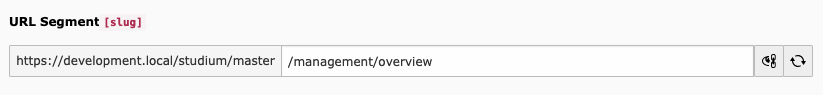

# sluggi — The little TYPO3 CMS slug helper

## What does it do?

The extension … 
* removes the page slug edit button for all non-administrators and users who are not members of the whitelisted backend user groups (see Extension Configuration below), so they are unable to edit the whole page URL slug anymore (which is usually desired with different permissions), but only the URL segments of pages they have permission to edit
* sets a fallback chain for page slug calculation as follows (the first nonempty value is used): the new 'Overwrite single URL segment' field (see Extension configuration below) > Alternative page title > Page title
* configures a replacement of forward slashes (`/`) in the page slug with a hyphen (`-`) for new pages (existing pages are not affected as long as you don't recalculate the slugs)

## Requirements

You need at least TYPO3 CMS version 9.5.5 including the following features:

* https://docs.typo3.org/typo3cms/extensions/core/Changelog/9.5.x/Feature-86740-AllowRemovalOfSlashInSlug.html
* https://docs.typo3.org/typo3cms/extensions/core/Changelog/9.5.x/Feature-87085-FallbackOptionsForSlugFields.html

## Installation

Require the package:

    composer require wazum/sluggi

Available on packagist:
https://packagist.org/packages/wazum/sluggi

## Extension configuration

* Set a list of whitelisted backend user group IDs in the extension configuration. Members of these groups will be able to edit the whole slug.

* Grant permissions for backend user groups to the page 'Overwrite single URL segment' field.

## Outlook into the future

I'm already working on another prototype where the limited edit functionality is incorporated into the existing single slug field.

