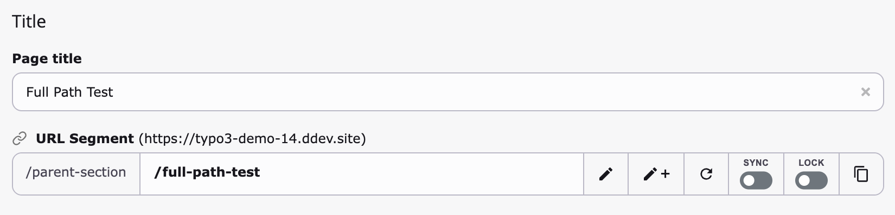
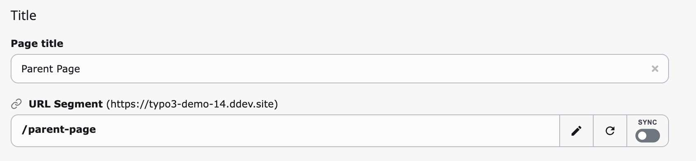
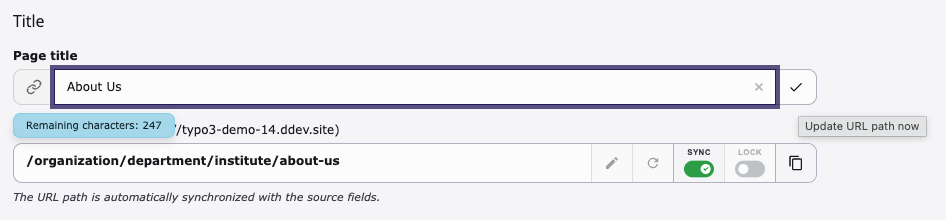
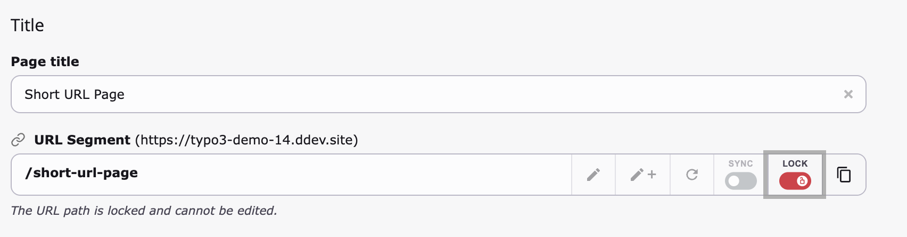
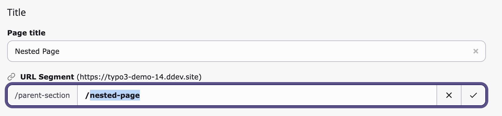
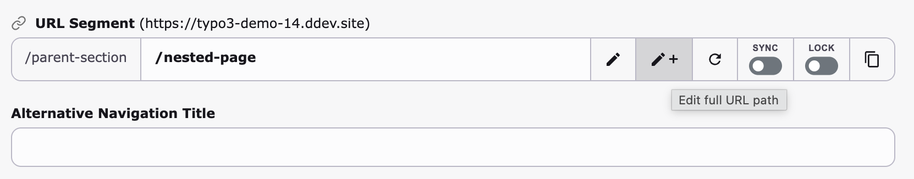
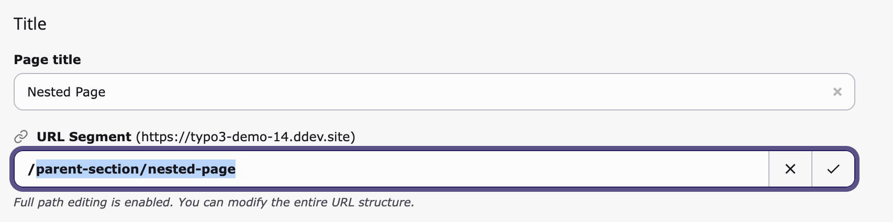
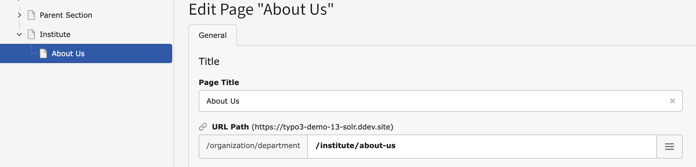
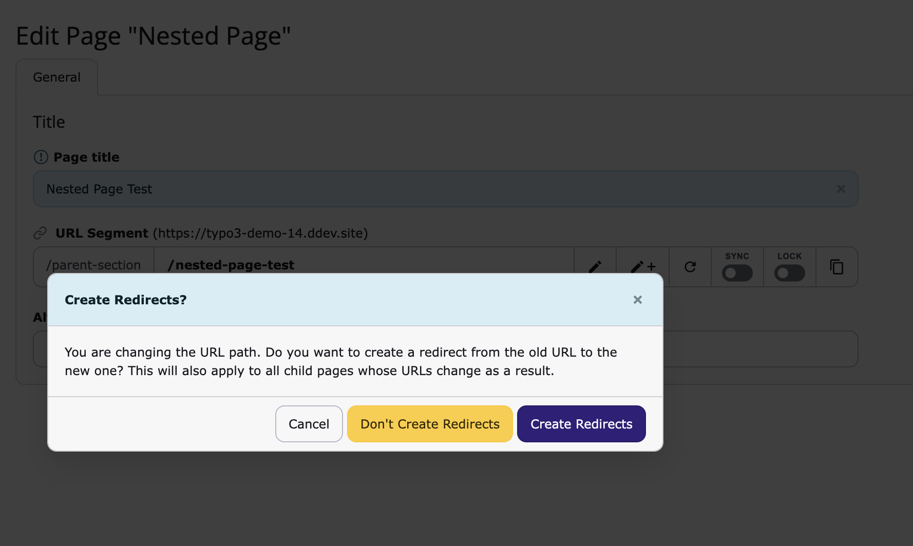
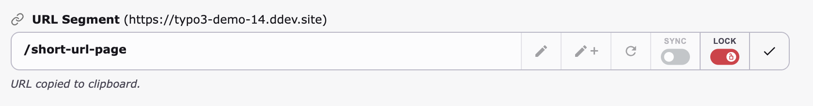

# sluggi – The URL Path Manager TYPO3 deserves

[](https://github.com/wazum/sluggi/actions)
[](https://www.php.net/)
[](https://typo3.org/)
[](LICENSE)

URLs that stay in sync when titles change. Automatic redirects. Duplicate prevention on copy, move, and recycler restore. Locking, access control, conflict detection – everything you need to manage URL paths with confidence.

One `composer require`, zero configuration needed.



## Installation

```bash
composer require wazum/sluggi
```

## What You Get

**Automatic sync** – Rename a page, the URL updates. All child pages follow. Redirects are created automatically.

**Conflict detection** – Duplicate URLs are caught instantly with unique alternatives proposed.

**Locking** – Pin critical URLs so nobody accidentally breaks them.

**Access control** – Let editors change the last segment only, or restrict editing based on their page tree permissions.

**Duplicate prevention** – Unique slugs on copy, move, and recycler restore. No more 500 errors from slug collisions.

**Redirect control** – Editors choose whether to create redirects when changing a URL.

**Any table** – Works with pages, news, events, or any record with a TCA slug field.

## Features

### Modern URL Path Editor

Out of the box, sluggi replaces the default slug field with a clean, focused interface:



### Auto-Sync: Change a Title, Update the URL

When sync is enabled, URL paths regenerate automatically when source fields (title, nav_title) change. A badge on the title field shows it drives the URL:



- Per-page sync toggle – disable it for pages with manually crafted URLs
- Child pages update recursively when a parent path changes
- Redirects from old to new URL are created automatically via EXT:redirects
- Works for any table with a slug field (news, events, custom records)

### Lock URLs to Prevent Accidental Changes



- Locked URLs cannot be edited and are skipped during auto-sync
- Optionally lock all descendant paths when an ancestor is locked
- Editing the full path auto-locks it to prevent sync from overwriting your work

### Granular Access Control for Editors

**Last segment only** – Non-admins edit just the final path segment. The parent path is read-only:



**Full path editing** – A button lets permitted users temporarily unlock the full path:





**Hierarchy permissions** – Editing is restricted based on page tree permissions. Users can only modify segments for pages they're allowed to edit:



### Redirect Control

Let editors decide whether to create redirects when a URL changes:



The choice applies recursively to all affected child pages. Self-referencing redirects are prevented automatically.

### Copy URL to Clipboard



### Slug Normalization

TYPO3 core turns a title like "Products/Services" into `/products/services` (two segments) instead of `/products-services` (one segment). sluggi fixes this globally – for manual edits, auto-sync, regeneration, and page tree inline editing. Optional underscore preservation (RFC 3986) is also available.

### Duplicate Prevention Where TYPO3 Core Doesn't

- **Copy**: Copied pages get unique slugs in the target location
- **Move**: Child slugs update to reflect the new parent path
- **Recycler restore**: Restored records get deduplicated slugs instead of causing 500 errors

### Excluded Page Types

Remove URL paths from page types that don't need them (Sysfolder, Recycler, Spacer). An upgrade wizard cleans up existing slugs.

## Configuration

All features work out of the box with sensible defaults. Fine-tune via **Admin Tools > Settings > Extension Configuration > sluggi**:

| Setting | Description | Default |
|---------|-------------|---------|
| `synchronize` | Keep URLs in sync with page titles automatically. When an editor renames a page, the URL path updates instantly – no manual work, no stale URLs. Redirects from old to new are created via EXT:redirects. | On |
| `synchronize_default` | Turn on sync for every newly created page. Editors can still disable it per page for manually crafted URLs. | On |
| `synchronize_tables` | Extend auto-sync beyond pages to any table with a slug field. Comma-separated list, e.g. `tx_news_domain_model_news`. Supports multi-field generation with `fieldSeparator`. | – |
| `lock` | Let editors pin important URLs so they can't be changed accidentally. Locked paths are also skipped during auto-sync, giving you full control over critical landing page URLs. | Off |
| `lock_descendants` | When a parent page has a locked URL, protect all child page URLs too. Useful for entire sections of your site where URL stability is critical (e.g. campaign landing pages). | Off |
| `last_segment_only` | Non-admin editors can only change the last segment of a URL path. The parent path stays read-only, preventing editors from accidentally breaking the site's URL hierarchy. | Off |
| `allow_full_path_editing` | Show a button that lets permitted editors temporarily unlock the full path for editing (requires `last_segment_only`). The slug auto-locks afterwards to prevent sync from overwriting the custom path. | Off |
| `exclude_doktypes` | Remove URL paths from page types that will never be visited directly. Comma-separated doktypes, e.g. `199,254,255` for Spacer, Sysfolder, and Recycler. Keeps your slug table clean. | – |
| `copy_url` | Show a button to copy the full page URL to the clipboard. Saves editors from navigating to the frontend just to grab a link for emails, documents, or tickets. | Off |
| `preserve_underscore` | Keep underscores in URL paths instead of converting them to dashes. Useful when your URL convention or external systems require underscores (RFC 3986 compliant). | Off |
| `redirect_control` | Show a modal when a URL changes, letting the editor decide whether to create a redirect. Gives editors control instead of silently creating redirects they may not want. The choice applies recursively to all affected child pages. | Off |

## Permissions

Every sluggi feature integrates with TYPO3's standard backend user and group permissions. You decide per user group which editors can see and use which controls – the same way you manage access to any other field in TYPO3:

| Field | Permission controls |
|-------|---------------------|
| `pages:slug` | Edit the URL path |
| `pages:tx_sluggi_sync` | Toggle sync on/off |
| `pages:slug_locked` | Lock/unlock URLs |
| `pages:tx_sluggi_full_path` | Use full path editing |

Example setup for a typical editorial team:

| | Admin | Senior Editor | Editor |
|---|:---:|:---:|:---:|
| Edit URL path | ✓ | ✓ | ✓ |
| Toggle sync | ✓ | ✓ | – |
| Lock/unlock URLs | ✓ | ✓ | – |
| Full path editing | ✓ | ✓ | – |

**Admin** – Full control over all URL features.

**Senior Editor** – Can lock critical URLs before a campaign launch, toggle sync for pages with manually crafted paths, and edit full URL paths when needed.

**Editor** – Can edit the last segment of a URL (with `last_segment_only` enabled), but cannot disable sync or unlock a locked URL. URLs stay consistent without extra training.

## User Settings

Users can enable compact controls via **User Settings > Personalization** to collapse controls behind a menu icon.

## Requirements

- TYPO3 12.4 – 14.x
- PHP 8.2+
- EXT:redirects

## Suggested Extensions

- [news-redirect-slug-change](https://github.com/georgringer/news-redirect-slug-change) – Redirects when news slugs change
- [ig-slug](https://github.com/internetgalerie/ig-slug) – Rebuild URL slugs in bulk
- [masi](https://github.com/b13/masi) – Exclude specific page slugs from subpage URL generation

## License

GPL-2.0-or-later
