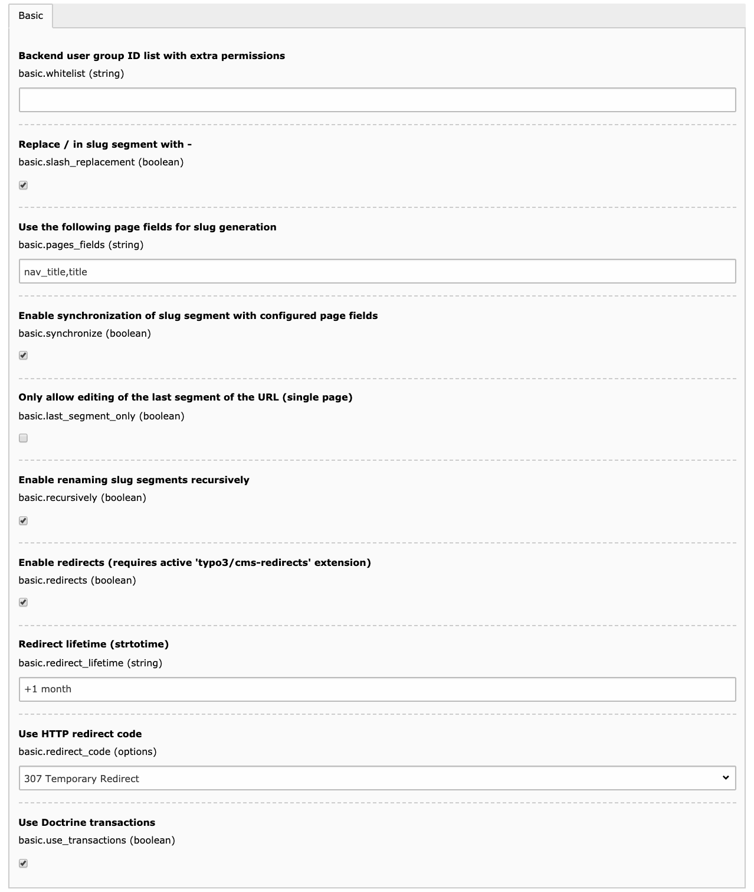
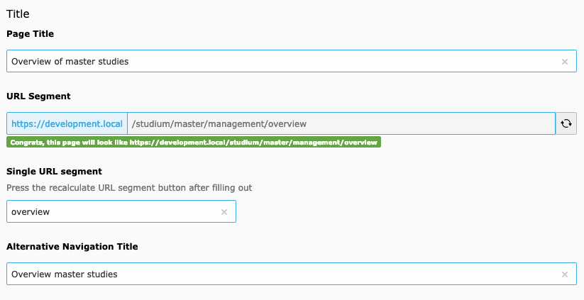
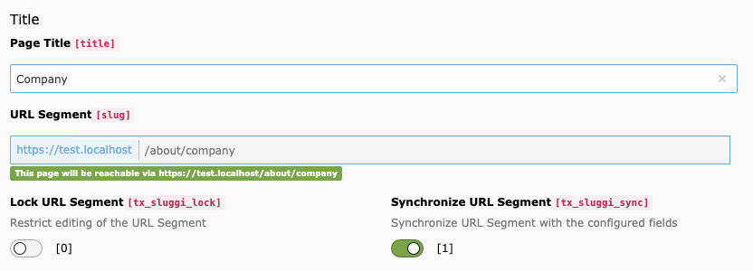

# sluggi — The little TYPO3 CMS slug helper

:fire: **Use sluggi < 2.0 for TYPO3 9 and sluggi >= 2.0 for TYPO3 10**

## Important changes

- with `2.1.0` the format for the `pages_fields` configuration option has changed to a JSON array string; see [TCA reference](https://docs.typo3.org/m/typo3/reference-tca/master/en-us/ColumnsConfig/Type/Slug/Properties/GeneratorOptions.html) for details

## What does it do?

The latest version of the extension … 
* modifies the page slug field, so normal users can only edit the part of the page slug they have appropriate permissions on the related pages (see screenshot and example below)
* allows administrators to restrict editing the page slug on certain pages
* updates slug segments when moving or copying a page (including child pages recursively)
* allows to synchronize the slug segment with the configured (title) fields automatically (behaviour like with RealURL)
* sets a fallback chain for page slug calculation as follows (the first nonempty value is used): Alternative page title > Page title (you can [change the fields](https://docs.typo3.org/m/typo3/reference-tca/master/en-us/ColumnsConfig/Type/Slug/Properties/GeneratorOptions.html) used in the extension configuration as JSON array string)
* configures a replacement of forward slashes (`/`) in the page slug with a hyphen (`-`) for new pages (existing pages are not affected as long as you don't recalculate the slugs)
* allows to set a flag to allow editing only for the last part of the URL (like with RealURL)
* respects any PageTypeSuffix route enhancer configuration (e.g. a '.html' suffix)

# Extension settings

You can configure all options for the extension via Admin Tools > Settings > Extension Configuration



Clear all caches after you change these settings.

# Site Configuration

If you need to change the default settings for the created redirects (or you want to disable them) you have to add this you your site configuration (`config.yaml`):

```yaml
settings:
  redirects:
    autoUpdateSlugs: true
    autoCreateRedirects: true
    redirectTTL: 3600
    forceHttps: true
    respectQueryParameters: true
    keepQueryParameters: true
    httpStatusCode: 301
```

# Backend editor example



In this example the editor has no rights to edit the _About_ page of the website, so he has no permission to change the _/about/_ segment of the URL too.

You can set a whitelist with backend user group IDs in the extension configuration. Members of these groups will still be able to edit the whole slug.

# Synchronize the URL with the configured fields

The most awaited feature is here!
(and this is still true for TYPO3 10 …)

No more URLs like '/about/translate-to-english-ueber-uns' because you forgot to press the re-generate button while translating a page.
_sluggi_ will do the hard work for you and keep the URL in sync with your configured (e.g. the title) field.



This feature is enabled by default, but you can switch it off in the extension configuration completely or on every single page if you need a different URL.

# Allow editing only for the last part of the URL

As of version 1.9.3, a flag can be set to allow editing only for the last part of the URL.
So editors can only change the path for the current page and not change the complete URL structure.

## Installation

Require the latest package:

    composer require wazum/sluggi

Available on TER and packagist:
https://packagist.org/packages/wazum/sluggi

## Sponsors

Thanks to [plan2net GmbH](https://www.plan2.net/) to let me work on the update for TYPO3 CMS 10 during working hours.

## Say thanks! and support me

You like this extension? Get something for me (surprise! surprise!) from my wishlist on [Amazon](https://smile.amazon.de/hz/wishlist/ls/307SIOOD654GF/) or [help me pay](https://www.paypal.me/wazum) the next pizza or Pho soup (mjam). Thanks a lot!
