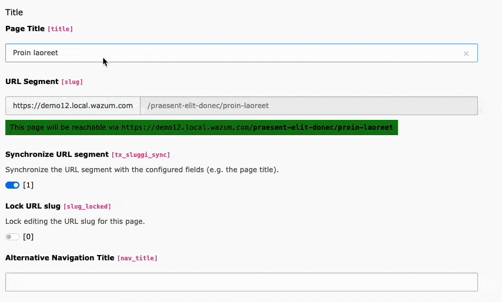
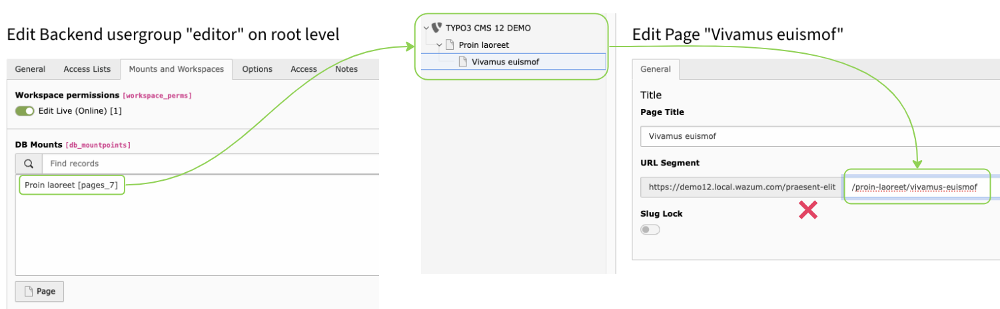
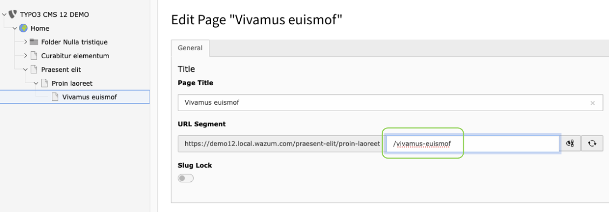
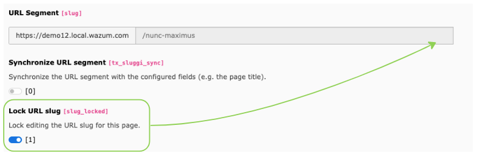
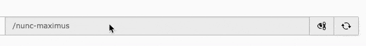
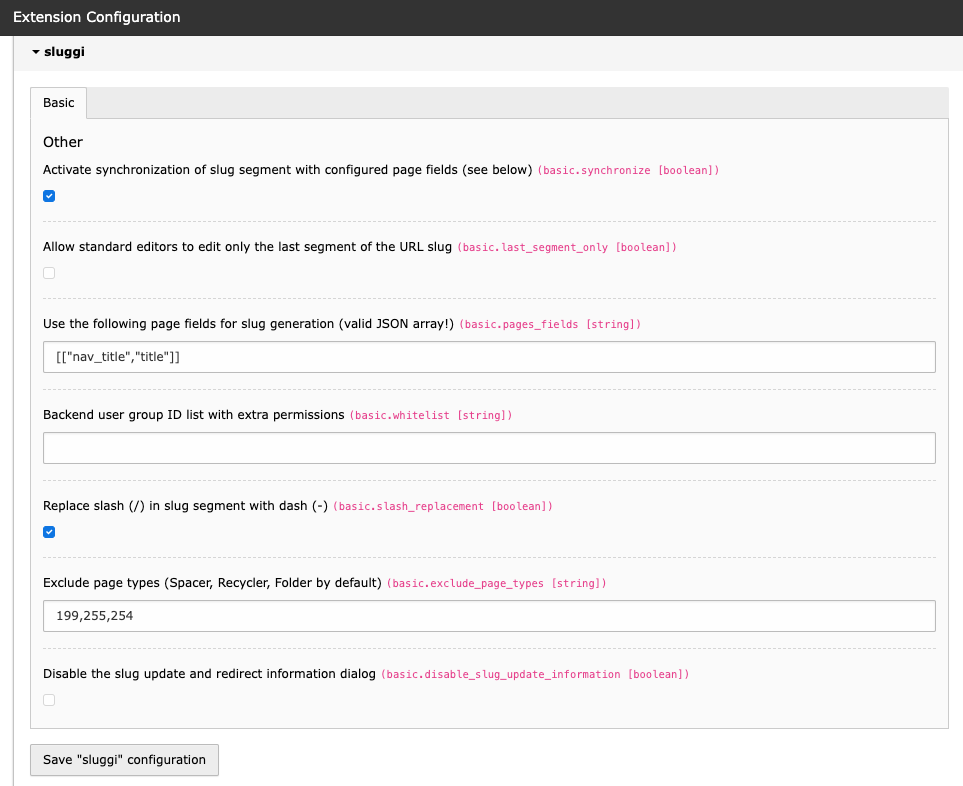

# sluggi

## Installation

Require the latest package with _composer_:

    composer require wazum/sluggi

Available on [TER](https://extensions.typo3.org/extension/sluggi) and [packagist](https://packagist.org/packages/wazum/sluggi).

## Features

- Normal users can only edit the part of the page slug they have permission to edit. This means that administrators can restrict editing the page slug on certain pages.
- The extension updates slug segments when a page is moved or copied, including all child pages.
- You can automatically synchronize the slug segment with configured fields (e.g. page title), so you never have to think about updating the URL slug segment manually when changing the page title or moving the page.
- The extension calculates the page slug based on a fallback chain. If there is an alternative page title, it will be used. Otherwise, the page title will be used. You can change the fields used in the extension configuration as a JSON array string (for more see below).
- Forward slashes in the page slug are replaced with hyphens for new pages by default, but existing pages are not affected unless you recalculate the slugs.
- You can set a flag to allow editing only for the last part of the URL (the segment for the current page). This corresponds to the earlier "realurl" approach.
- You can lock a slug from updates.

Let's take a more detailed look at some of the features now.

### Slug synchronization with configured fields

If the setting is enabled (see below, default is yes), then the URL slug segment will automatically adjust when the value in any of the configured fields changes.
This also works if you change the title e.g. directly via the page tree.



You can disable this globally or per individual page with the toggle below the URL segment. The URL segment is updated as soon as the input loses focus or you toggle the synchronization switch.

### Slug editing on restricted pages

Normal users can edit only the part of the page slug for which they have editing permission. Let's assume there is a DB mount and no permission to edit the pages above it, then the result would look like this:



The user is not allowed to change anything on the "Praesent Elit" page above it in the page tree, so it's not possible to change the slug part for this page either.

### Edit only the last URL slug segment part

You can enable that only the last part of the URL slug can be edited. This corresponds to the former "realurl" approach.



### Locking the URL slug segment

Administrators or users with appropriate rights to the lock field can lock editing of the URL slug segment of a page.



Locking and synchronizing are mutually exclusive.

### Simple edit

You can now simply double-click on the slug field to edit it. The edit button is still available.



## Extension settings

You can configure all options for the extension via Admin Tools > Settings > Extension Configuration



Clear the cache after changing settings!

### Allow standard editors to edit only the last segment of the URL slug

`synchronize`

_Default_: `1` (enabled)

### Allow standard editors to edit only the last segment of the URL slug

`last_segment_only`

_Default_: `0` (disabled)

### Use the following page fields for slug generation (valid JSON array!)

`pages_fields`

_Default_: `[["nav_title","title"]]`

This has to be a valid JSON string!

### Backend user group ID list with extra permissions

`whitelist`

_Default_: ` ` (_empty_)

Members of this group are treated like administrators as far as the URL slug segment is concerned.

### Replace slash (/) in slug segment with hyphen (-)

`slash_replacement`

_Default_: `1` (enabled)

### Exclude page types (Spacer, Recycler, Folder by default)

`exclude_page_types`

_Default_: `199,255,254`

This setting is relevant if you want to use _sluggi_ and _masi_ together (see below).

All slug related fields are removed from the backend interface for these page types too.

## Dependencies and automatic redirects

_sluggi_ depends on the Core `typo3/cms-redirects` package, as only this extension allows recursive updating of page slugs when updating a parent page.

If you don't want automatic redirects created, you can easily disable them in your website configuration (`config/sites/my-site/config.yaml`).
Set `autoCreateRedirects` to `false`.

```yaml
settings:
   redirects:
     # Automatically update slugs of all sub pages
     # (default: true)
     autoUpdateSlugs: true
     # Automatically create redirects for pages with a new slug (works only in LIVE workspace)
     # (default: true)
     autoCreateRedirects: true
     # Time To Live in days for redirect records to be created - `0` disables TTL, no expiration
     # (default: 0)
     redirectTTL: 30
     # HTTP status code for the redirect, see
     # https://developer.mozilla.org/en-US/docs/Web/HTTP/Redirections#Temporary_redirections
     # (default: 307)
     httpStatusCode: 307
```

Source: https://docs.typo3.org/c/typo3/cms-core/main/en-us/Changelog/10.1/Feature-89115-Auto-createRedirectsOnSlugChanges.html

## Compatibility with other extensions

### _masi_ (https://github.com/b13/masi)

If you want to set slugs for folders too, you need _masi_.
The code is compatible with _masi_ (>= `2.0`) and there's a configuration option to set the excluded page types:

    # cat=basic; type=string; label=Exclude page types (Spacer, Recycler, Folder by default)
    exclude_page_types=199,255,254

The default is the list the core uses.
If you want to use _masi_, set the value to `255` (recycler) only.

When you change the "Exclude this page for slug generation of subpages" toggle, _sluggi_ will regenerate the slug for all the subpages of the current page.
If you want to preserve slugs for certain subpages you have to _lock_ them before.

_sluggi_ removes the configuration for `['behaviour']['allowLanguageSynchronization']` and sets `'l10n_mode' = 'exclude'` for the `exclude_slug_for_subpages` field. Makes no sense in my eyes and I don't want to deal with the problems.

### _ig_slug_ (https://github.com/internetgalerie/ig_slug)

The field `tx_sluggi_lock` has been renamed to `slug_locked` in version 12, so both extensions can work together.

Use the provided upgrade wizard ("Migrate tx_sluggi_lock field") to transfer your existing settings to the new field. You can remove `tx_sluggi_lock` from the database table `pages` afterwards.

## Support and feature requests

Use the [issues tracker](https://github.com/wazum/sluggi/issues) on GitHub for support questions and new feature requests or ideas concerning the extension.

## Sponsors

Thanks to [plan2net GmbH](https://www.plan2.net/) to let me work on the extension during working hours.

Special thanks to [TU München](https://www.tum.de/) and other German universities who sponsored my time at _plan2net GmbH_ to work on general improvements, bugfixes, new features and the update for PHP 8 and TYPO3 CMS 12 (including backports of certain bugfixes in earlier versions).

## Say thanks! and support me

You like this extension? Get something for me (surprise! surprise!) from my wishlist on [Amazon](https://smile.amazon.de/hz/wishlist/ls/307SIOOD654GF/) or [help me pay](https://www.paypal.me/wazum) the next pizza or Pho soup (mjam). Thanks a lot!
