<p align="center">
  
</p>
<h1 align="center">sluggi</h1>
<p align="center"><em>The URL Path Manager TYPO3 CMS deserves.</em></p>
<br>

[](https://github.com/wazum/sluggi/actions)
[](https://www.php.net/)
[](https://typo3.org/)
[](https://packagist.org/packages/wazum/sluggi)
[](https://github.com/wazum/sluggi/stargazers)
[](LICENSE)

URLs that stay in sync when titles change. Automatic redirects. Duplicate prevention on copy, move, and recycler restore. Locking, access control, conflict detection – everything you need to manage URL paths with confidence.

> [!NOTE]
> **TYPO3 13.4** has a core bug where `TemporaryPermissionMutationService` does not grant page-level access for redirect storage. Non-admin editors without the site root page in their webmounts cannot create redirects on slug changes. Sluggi includes a workaround; this does not affect TYPO3 12 or 14.

One `composer require`, sensible defaults – [highly configurable](#configuration) when you need it.

<p align="center">
  <a href="https://wazum.github.io/sluggi/"><strong>Try the interactive demo</strong></a><br>
  See every feature live in your browser – no installation required.
</p>

## Installation

```bash
composer require wazum/sluggi
```

> **Version 14** is a complete rewrite of _sluggi_ – modern, fully tested, and **compatible** with **TYPO3 12.4, 13.4.26+, and 14**.
> 
> This is the version you should install regardless of your TYPO3 version. Previous major versions are no longer maintained.

## What You Get

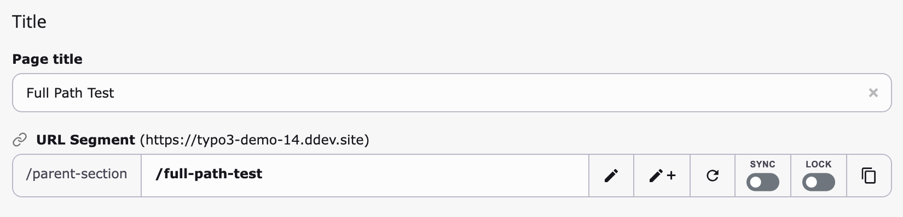

**Automatic sync** – Rename a page, the URL updates. All child pages follow. Redirects are created automatically.

**Conflict detection** – Duplicate URLs are caught instantly with unique alternatives proposed.

**Locking** – Pin critical URLs so nobody accidentally breaks them.

**Access control** – Let editors change the last segment only, or restrict editing based on their page tree permissions.

**Duplicate prevention** – Unique slugs on copy, move, and recycler restore. No more 500 errors from slug collisions.

**Redirect control** – Editors choose whether to create redirects when changing a URL.

**Redirect info** – See how many redirects point to a page, with a direct link to manage them.

**Any table** – Works with pages, news, events, or any record with a TCA slug field.

## Features

### Modern URL Path Editor

Out of the box, _sluggi_ replaces the default slug field with a clean, focused interface:

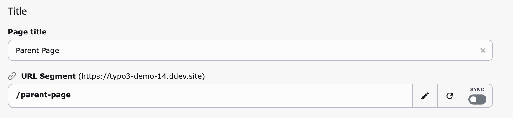

### Auto-Sync: Change a Title, Update the URL

When sync is enabled, URL paths regenerate automatically when source fields (e.g. title, nav_title) change. A badge on the source field shows it drives the URL:

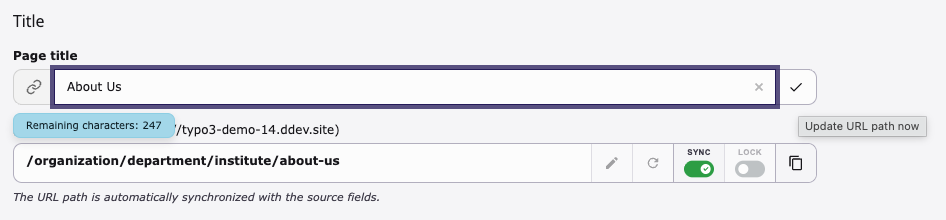

- Per-record sync toggle – disable it for pages or records with manually crafted URLs
- Child pages update recursively when a parent path changes
- Redirects from old to new URL are created automatically via EXT:redirects
- Works for any table with a slug field (news, events, custom records)

### Lock URLs to Prevent Accidental Changes

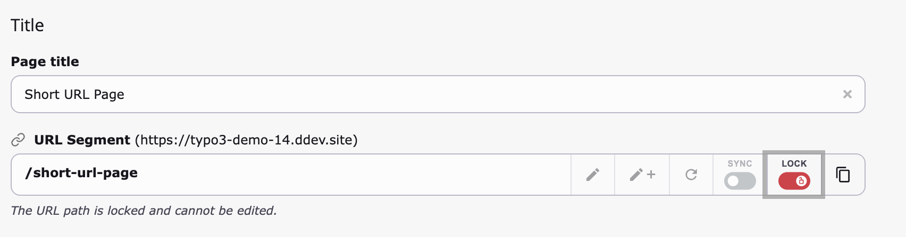

- Locked URLs cannot be edited and are skipped during auto-sync
- Optionally lock all descendant paths when an ancestor is locked
- Editing the full path auto-locks it to prevent sync from overwriting your work

### Translated Pages

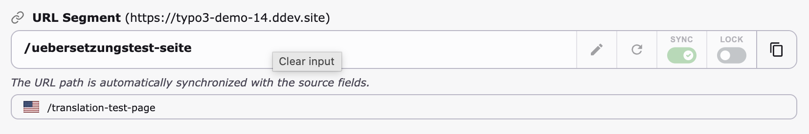

Translated pages inherit the sync and lock settings from the default language record. The toggles are disabled and display the parent's state – translations cannot override these flags independently. This ensures consistent URL behavior across all language versions.

### Non-Page Tables (News, Events, Custom Records)

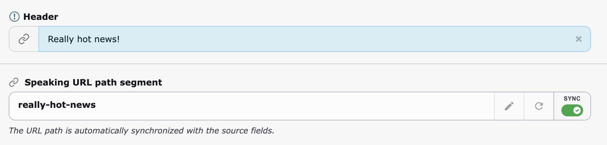

Tables configured in `synchronize_tables` (e.g. `tx_news_domain_model_news`) get the same per-record sync toggle as pages. Editors can disable auto-sync for individual records where they've manually crafted a slug for SEO:

- Sync defaults to **on** for new records – slugs auto-generate from source fields
- Toggle sync **off** to keep a hand-crafted slug that won't change when the title is edited
- Source field badges appear when sync is active, showing which fields drive the slug
- Translated records inherit the sync state from their default language parent
- Sync state is stored in a separate reference table – no changes to your extension's database schema

### Granular Access Control for Editors

**Last segment only** – Non-admins edit just the final path segment. The parent path is read-only:

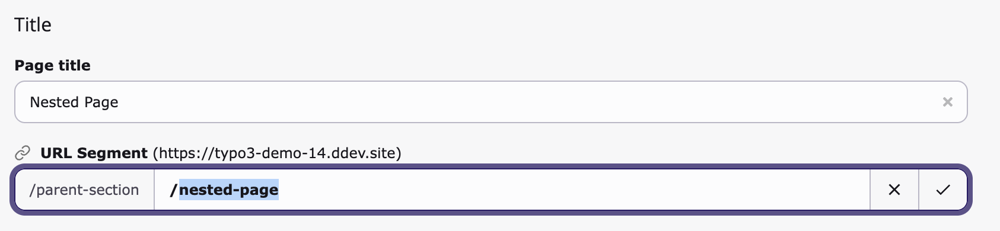

**Full path editing** – A button lets permitted users temporarily unlock the full path:

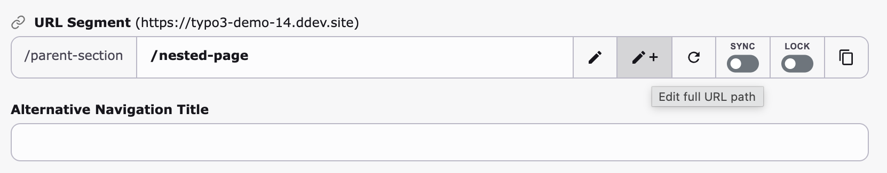

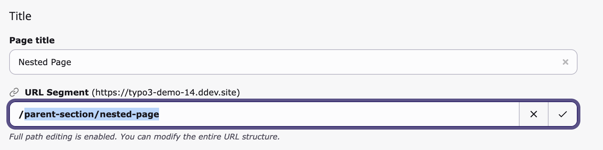

**Hierarchy permissions** – Editing is restricted based on page tree permissions. Users can only modify segments for pages they're allowed to edit:

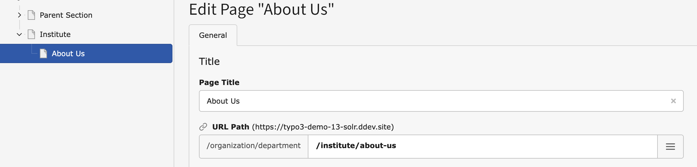

### Out-of-Sync URL Detection

When a page's URL path doesn't match the page hierarchy (e.g. after a page move, a manual admin edit, or a database import), _sluggi_ detects the mismatch and informs the editor with a subtle amber highlight on the prefix, a one-time notification, and an inline note below the field:

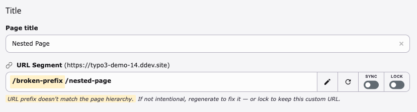

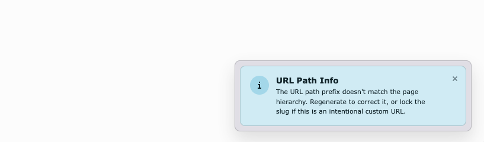

The messages are tailored to the editor's permissions:
- Editors who can lock URLs are advised to either regenerate or lock the slug to keep a custom URL
- Editors without lock access are pointed to the regenerate button or advised to ask an administrator
- Admins see the full URL path with the mismatched portion highlighted

Locked and synced pages suppress the indicator entirely – locked pages have intentional custom URLs, and synced pages will self-correct on the next title change.

### Redirect Info

See at a glance how many redirects target a page, with a direct link to the redirects module:

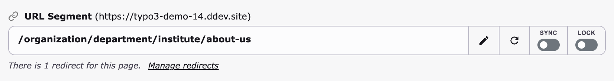

Only shown to editors with access to the redirects module and `sys_redirect` table.

### Redirect Control

Let editors decide whether to create redirects when a URL changes:

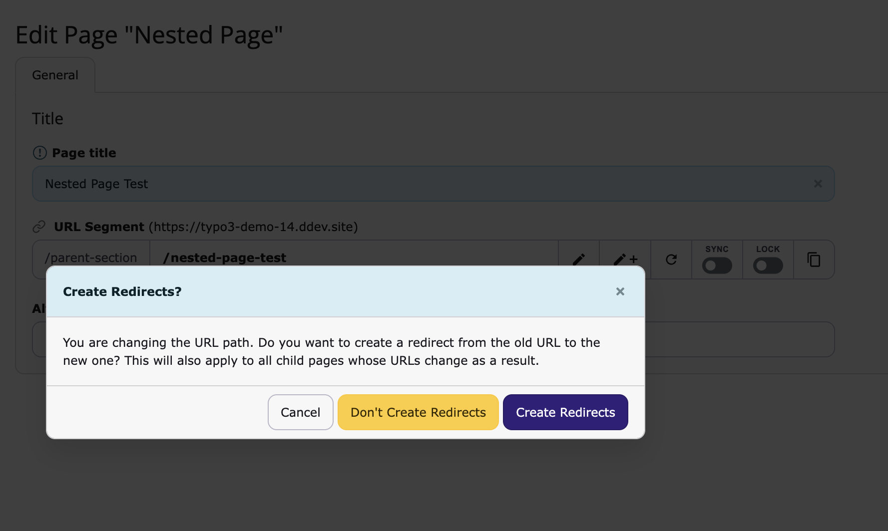

The choice applies recursively to all affected child pages. Self-referencing redirects are prevented automatically, and stale redirect cleanup only affects auto-created redirects – manually created redirects are never touched.

### Re-apply URL Paths Recursively

Right-click any page in the page tree and select **More options > Re-apply URL paths recursively** to regenerate URL paths for all descendant pages based on their current source fields (e.g. title, nav_title):

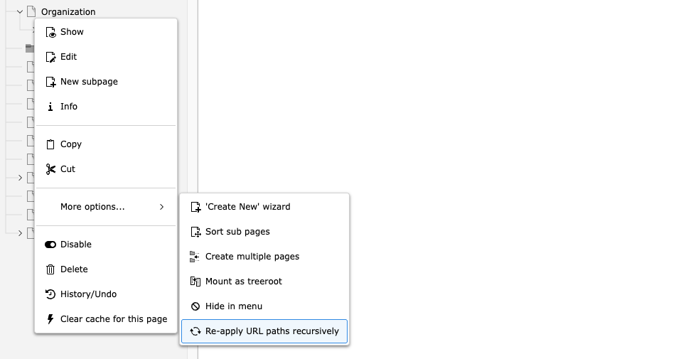

- Useful after reverting a slug change via TYPO3's undo notification, or when child pages have stale prefixes
- Slugs are regenerated from scratch using source fields – not by prefix replacement
- Hidden pages are included, locked pages are skipped (descendants still update unless `lock_descendants` is enabled)
- All changes share a single correlation ID – TYPO3's undo notification lets you revert everything at once
- Admin users only

### Copy URL to Clipboard

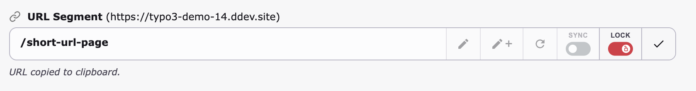

### Slug Normalization

TYPO3 core turns a title like "Products/Services" into `/products/services` (two segments) instead of `/products-services` (one segment). _sluggi_ fixes this globally – for manual edits, auto-sync, regeneration, and page tree inline editing. Optional underscore preservation (RFC 3986) is also available.

### Duplicate Prevention Where TYPO3 Core Doesn't

- **Copy**: Copied pages get unique slugs in the target location
- **Move**: Child slugs update to reflect the new parent path
- **Recycler restore**: Restored records get deduplicated slugs instead of causing 500 errors

### Excluded Page Types

Remove URL paths from page types that don't need them (Sysfolder, Recycler, Spacer). An upgrade wizard cleans up existing slugs.

## Configuration

All features work out of the box with sensible defaults. Fine-tune via **System > Settings > Extension Configuration > _sluggi_**:

**Basic**

| Setting | Description | Default |
|---------|-------------|---------|
| `exclude_doktypes` | Comma-separated doktypes excluded from slug path generation. The default `199,254` matches TYPO3 core's built-in exclusion of Spacer and Sysfolder (see `SlugHelper::resolveParentPageRecord()`). Add `255` to also exclude Recycler pages. If you use [b13/masi](https://github.com/b13/masi) to include sysfolders in URL paths, remove `254` from this list. | `199,254` |
| `preserve_underscore` | Keep underscores in URL paths instead of converting them to dashes. Useful when your URL convention or external systems require underscores (RFC 3986 compliant). | Off |
| `copy_url` | Show a button to copy the full page URL to the clipboard. Saves editors from navigating to the frontend just to grab a link for emails, documents, or tickets. | On |
| `last_segment_only` | Non-admin editors can only change the last segment of a URL path. The parent path stays read-only, preventing editors from accidentally breaking the site's URL hierarchy. | Off |
| `allow_full_path_editing` | Show a button that lets permitted editors temporarily unlock the full path for editing (requires `last_segment_only`). The slug auto-locks afterwards to prevent sync from overwriting the custom path. | Off |

**Sync**

| Setting | Description | Default |
|---------|-------------|---------|
| `synchronize` | Keep URLs in sync with page titles automatically. When an editor renames a page, the URL path updates instantly – no manual work, no stale URLs. Redirects from old to new are created via EXT:redirects. | On |
| `synchronize_default` | Turn on sync for every newly created page. Editors can still disable it per page for manually crafted URLs. | On |
| `synchronize_tables` | Extend auto-sync beyond pages to any table with a slug field. Comma-separated list, e.g. `tx_news_domain_model_news`. Each configured table gets a per-record sync toggle so editors can opt out individually. Supports multi-field generation with `fieldSeparator`. | – |

**Lock**

| Setting | Description | Default |
|---------|-------------|---------|
| `lock` | Let editors pin important URLs so they can't be changed accidentally. Locked paths are also skipped during auto-sync, giving you full control over critical landing page URLs. | Off |
| `lock_descendants` | When a parent page has a locked URL, protect all child page URLs too. Useful for entire sections of your site where URL stability is critical (e.g. campaign landing pages). | Off |

**Redirect**

| Setting | Description | Default |
|---------|-------------|---------|
| `redirect_control` | Show a modal when a URL changes, letting the editor decide whether to create a redirect. Gives editors control instead of silently creating redirects they may not want. The choice applies recursively to all affected child pages. | Off |
| `show_redirects` | Display the number of active redirects targeting a page below the slug field, with a link to the redirects module pre-filtered by target page. Only shown to users with access to the redirects module. Requires EXT:redirects. | Off |

For deployment or version-controlled configuration, set values in `config/system/additional.php`:

```php
$GLOBALS['TYPO3_CONF_VARS']['EXTENSIONS']['sluggi'] = [
    'synchronize' => '1',
    'synchronize_default' => '1',
    'synchronize_tables' => 'tx_news_domain_model_news',
    'lock' => '1',
    'lock_descendants' => '0',
    'last_segment_only' => '1',
    'allow_full_path_editing' => '1',
    'exclude_doktypes' => '199,254,255',
    'copy_url' => '1',
    'preserve_underscore' => '0',
    'redirect_control' => '1',
    'show_redirects' => '1',
];
```

## Site Configuration: Redirects & Recursive Slug Updates

_sluggi_ requires [EXT:redirects](https://docs.typo3.org/c/typo3/cms-redirects/main/en-us/) which controls what happens when a page slug changes: whether child pages update recursively, whether redirects are created, how long they live, and which HTTP status code they use.

These settings are configured **per site** via [TYPO3 site sets](https://docs.typo3.org/m/typo3/reference-coreapi/main/en-us/ApiOverview/SiteHandling/SiteSettings.html). To activate them, add the `typo3/redirects` set to your site's `config.yaml` and override the defaults in `settings.yaml`.

### Step 1: Add the redirects site set

In `config/sites/<your-site>/config.yaml`, add `typo3/redirects` to the `dependencies` list:

```yaml
base: 'https://example.com/'
rootPageId: 1
dependencies:
  - typo3/redirects
languages:
  # ...
```

### Step 2: Override settings

Create `config/sites/<your-site>/settings.yaml` with the settings you want to change:

```yaml
redirects:
  autoUpdateSlugs: true
  autoCreateRedirects: true
  redirectTTL: 0
  httpStatusCode: 301
```

### Available Settings

| Setting | Type | Default | Description |
|---------|------|---------|-------------|
| `redirects.autoUpdateSlugs` | bool | `true` | Recursively update child page slugs when a parent slug changes. Works together with _sluggi_'s auto-sync – when a title change triggers a slug update on a parent page, all descendants get their slug prefix replaced automatically. |
| `redirects.autoCreateRedirects` | bool | `true` | Create redirect records from old to new URL when a slug changes. Only applies in the **live workspace** – editing in a workspace does not create redirects until the change is published. |
| `redirects.redirectTTL` | int | `0` | Lifetime in **days** for auto-created redirects. `0` means no expiration. When set, the redirect's `endtime` is calculated as creation time + TTL days. |
| `redirects.httpStatusCode` | int | `307` | HTTP status code for auto-created redirects. Does not affect manually created redirects. Common values: `301` (Moved Permanently – best for SEO), `302` (Found), `307` (Temporary Redirect – the default). |

> **How this relates to sluggi:** When _sluggi_'s auto-sync regenerates a slug (because the page title changed), EXT:redirects picks up the change and applies the settings above. If `autoUpdateSlugs` is enabled, child pages update recursively. If `autoCreateRedirects` is enabled, redirect records are created for the old URLs. The `redirectTTL` and `httpStatusCode` settings control the properties of those redirect records. When _sluggi_'s `redirect_control` feature is enabled, editors can override `autoCreateRedirects` on a per-change basis via a modal dialog.

### Ready-to-Use Configuration Presets

_sluggi_ ships ready-to-use presets in [`Configuration/SiteSettings/`](Configuration/SiteSettings/). TYPO3's YAML loader supports [`imports`](https://docs.typo3.org/m/typo3/reference-coreapi/main/en-us/ApiOverview/YamlApi/Index.html#imports) with `EXT:` paths, so you can reference them directly from your `settings.yaml` without copying files.

Create `config/sites/<your-site>/settings.yaml` with an import:

```yaml
imports:
  - { resource: 'EXT:sluggi/Configuration/SiteSettings/recommended.settings.yaml' }
```

You can override individual values after the import:

```yaml
imports:
  - { resource: 'EXT:sluggi/Configuration/SiteSettings/recommended.settings.yaml' }

# Override just the TTL from the preset
redirects:
  redirectTTL: 180
```

**Available presets:**

| Preset | Status code | TTL | Description |
|--------|:-----------:|:---:|-------------|
| [recommended](Configuration/SiteSettings/recommended.settings.yaml) | 301 | permanent | Best for production sites where SEO matters |
| [temporary-with-ttl](Configuration/SiteSettings/temporary-with-ttl.settings.yaml) | 307 | 90 days | Sites with frequently changing content (news, events, campaigns) |
| [no-auto-redirects](Configuration/SiteSettings/no-auto-redirects.settings.yaml) | – | – | Recursive slug updates only, redirects managed externally or manually |
| [manual-only](Configuration/SiteSettings/manual-only.settings.yaml) | – | – | No recursive updates, no auto-redirects, full manual control |

### How It All Fits Together

| What happens | `autoUpdateSlugs` | `autoCreateRedirects` | sluggi `synchronize` | sluggi `redirect_control` |
|---|:---:|:---:|:---:|:---:|
| Title changes → slug updates | – | – | **controls this** | – |
| Parent slug changes → child slugs update | **controls this** | – | – | – |
| Old URL → redirect to new URL | – | **controls this** | – | – |
| Editor chooses whether to create redirect | – | must be `true` | – | **controls this** |

For the full EXT:redirects documentation, see the [TYPO3 Redirects Setup](https://docs.typo3.org/c/typo3/cms-redirects/main/en-us/Setup/Index.html). For details on TYPO3 site sets and settings, see [Site Settings](https://docs.typo3.org/m/typo3/reference-coreapi/main/en-us/ApiOverview/SiteHandling/SiteSettings.html).

## Permissions

Every _sluggi_ feature integrates with TYPO3's standard backend user and group permissions. You decide per user group which editors can see and use which controls – the same way you manage access to any other field in TYPO3:

| Field | Permission controls |
|-------|---------------------|
| `pages:slug` | Edit the URL path |
| `pages:tx_sluggi_sync` | Toggle sync on/off |
| `pages:slug_locked` | Lock/unlock URLs |
| `pages:tx_sluggi_full_path` | Use full path editing |

Example setup for a typical editorial team:

| | Admin | Senior Editor | Editor |
|---|:---:|:---:|:---:|
| Edit URL path | ✓ | ✓ | ✓ |
| Toggle sync | ✓ | ✓ | – |
| Lock/unlock URLs | ✓ | ✓ | – |
| Full path editing | ✓ | ✓ | – |

**Admin** – Full control over all URL features.

**Senior Editor** – Can lock critical URLs before a campaign launch, toggle sync for pages with manually crafted paths, and edit full URL paths when needed.

**Editor** – Can edit the last segment of a URL (with `last_segment_only` enabled), but cannot disable sync or unlock a locked URL. URLs stay consistent without extra training.

## User Settings

Users can enable compact controls via **User Settings > Personalization** to collapse controls behind a menu icon.

## Slug Source Fields

_sluggi_ reads the source fields for slug generation from the standard TCA [`generatorOptions.fields`](https://docs.typo3.org/m/typo3/reference-tca/main/en-us/ColumnsConfig/Type/Slug/Index.html) configuration of the `slug` column. All referenced fields are automatically detected — they get a badge in the backend and the frontend component listens to them for real-time sync.

```php
'slug' => [
    'config' => [
        'type' => 'slug',
        'generatorOptions' => [
            'fields' => [['nav_title', 'title']],
        ],
    ],
],
```

For more configuration options (e.g. multiple fields, fallback chains, field separators), see the [TYPO3 TCA slug documentation](https://docs.typo3.org/m/typo3/reference-tca/main/en-us/ColumnsConfig/Type/Slug/Index.html).

For non-page tables, add the table name to the `synchronize_tables` extension setting. The slug auto-regenerates whenever a source field changes on save, unless the editor has disabled sync for that specific record via the per-record toggle.

## Requirements

- TYPO3 12.4, 13.4.26+, or 14.x
- PHP 8.2+
- EXT:redirects

## Suggested Extensions

- [news-redirect-slug-change](https://github.com/georgringer/news-redirect-slug-change) – Redirects when news slugs change
- [ig-slug](https://github.com/internetgalerie/ig_slug) – Rebuild URL slugs in bulk
- [masi](https://github.com/b13/masi) – Exclude specific page slugs from subpage URL generation
- [content_slug](https://github.com/sebkln/content_slug) – Slug field for human-readable content element anchors (`#my-section`)

## Fixes for TYPO3 Core Issues

_sluggi_ works around these known TYPO3 core issues:

- [#108375](https://forge.typo3.org/issues/108375) – When multiple pages are updated in a single DataHandler operation (e.g. recursive slug update), TYPO3 core assigns each page its own correlation ID, making it impossible to revert all changes at once via the undo notification. _sluggi_ shares one correlation ID across all pages in the operation so the entire batch can be reverted with a single click.
- [#108870](https://forge.typo3.org/issues/108870) – The "Revert update" notification after a slug change only rolls back child page slugs and redirect records, but not the parent page's own slug change. _sluggi_ extends the rollback to include the parent page so the entire change is fully reverted.
- [#106152](https://forge.typo3.org/issues/106152) – Restoring pages from the recycler does not check for slug conflicts, which can result in duplicate URLs and 500 errors. _sluggi_ validates and deduplicates slugs on restore.
- [#86740](https://forge.typo3.org/issues/86740) – TYPO3 core treats slashes in page titles as path separators, turning "Products/Services" into two URL segments instead of one. _sluggi_ normalizes slashes to the fallback character globally.
- [#103833](https://forge.typo3.org/issues/103833) – Renaming a slug back to a previous value can leave behind a self-referencing redirect. _sluggi_ prevents creation of self-referencing redirects automatically.
- [#97962](https://forge.typo3.org/issues/97962) – TYPO3 core always replaces underscores with the fallback character during slug generation. _sluggi_ adds a `preserve_underscore` setting for RFC 3986 compliant URLs.
- [#94003](https://forge.typo3.org/issues/94003) – When copying a page subtree, TYPO3 core changes the copied parent's slug immediately (e.g. appending `-1`) but fails to update child pages' slug prefixes accordingly. _sluggi_ recalculates all slugs in the copied tree with correct parent prefixes.
- In TYPO3 13.4, `TemporaryPermissionMutationService` grants `tables_modify` for `sys_redirect` but does not grant page-level access. Editors without the site root page in their webmounts cannot create redirect records. _sluggi_ bypasses page-level access checks for redirect creation DataHandler operations.

## Upgrading

### 14.0.0

**Configuration keys renamed**

The following extension configuration keys were renamed. Your existing values are **not** migrated automatically — update them manually in `config/system/additional.php` or via **Admin Tools > Settings > Extension Configuration**:

| Old key (v12/v13) | New key (v14) |
|---|---|
| `exclude_page_types` | `exclude_doktypes` |
| `allow_lock` | `lock` |

**Configuration keys removed**

| Removed key | Replacement |
|---|---|
| `pages_fields` | Configure source fields via TCA `generatorOptions.fields` |
| `whitelist` | Use standard TYPO3 backend user/group permissions for `pages:slug` |
| `slash_replacement` | Now always active, no longer configurable |

**Redirect settings moved to site configuration**

Extension-level redirect keys (`redirect_lifetime`, `redirect_code`, `redirect_force_https`, `redirect_respect_query_parameters`, `redirect_keep_query_parameters`) were removed. Use TYPO3's native per-site redirect settings instead. Ready-made presets are shipped in `Configuration/SiteSettings/`.

### 14.2.0

**`exclude_doktypes` default changed from empty to `199,254`** ([#135](https://github.com/wazum/sluggi/issues/135))

Previous versions shipped with an empty `exclude_doktypes` default, which caused sluggi's copy/move handlers to include Spacer and Sysfolder names in generated slug paths — contrary to TYPO3 core's built-in behavior in `SlugHelper::resolveParentPageRecord()`. The default is now `199,254` (Spacer, Sysfolder) to match core.

Sluggi now also overrides core's `resolveParentPageRecord()` so that _all_ slug generation paths (AJAX suggestions, new pages, copy, move, sync) consistently respect the `exclude_doktypes` setting. Without this override, TYPO3 core hardcodes the exclusion of Spacer and Sysfolder regardless of configuration.

**Upgrade wizard:** Run **Admin Tools > Upgrade > Upgrade Wizard** after updating. The wizard _"Set default excluded page types for sluggi"_ sets `exclude_doktypes` to `199,254` for existing installations where it was empty.

**[b13/masi](https://github.com/b13/masi) users:** If you use masi to include sysfolders in URL paths, remove `254` from `exclude_doktypes` after the upgrade. Masi uses a TCA `postModifier` (not an XCLASS), so both extensions work together without conflicts — masi overrides the generated slug after sluggi's `SlugHelper`, and both will consistently include the sysfolder when `254` is not in the exclusion list.

## Support and Feature Requests

Use the [issues tracker](https://github.com/wazum/sluggi/issues) on GitHub for support questions and new feature requests or ideas concerning the extension.

## Credits and Sponsors

Made with love for the TYPO3 community by [Wolfgang Klinger](https://wolfgang-klinger.dev/).

Many thanks to [plan2net GmbH](https://www.plan2.net/) for allowing me to work on the extension during my working hours and for great projects where this extension is already being used in real life.

Special thanks to [TU München](https://www.tum.de/) and other German universities that sponsored my time at _plan2net GmbH_ to work on this extension (_applies to previous versions_).

## License

GPL-2.0-or-later

<br>
<p align="center">
  
</p>
